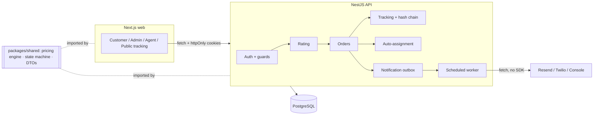

# Last-Mile Delivery Tracker

**🔴 Live demo:** https://last-mile-delivery-tracker-web-alpha.vercel.app  

**API docs (Swagger):** https://lmd-api.onrender.com/docs  

**Public tracking (no login):** [/track/LMD-2608-000001](https://last-mile-delivery-tracker-web-alpha.vercel.app/track/LMD-2608-000001)

> The API runs on a Render free instance — the first request after a period of inactivity can take ~30–50 s to wake, then it's fast.

A production-shaped last-mile logistics platform: customers and admins create
delivery orders, charges are computed by a **fully configurable rate engine**,
delivery agents are assigned **manually or automatically with an explainable
decision**, and every status change is recorded in an **immutable, hash-chained
tracking history**. Customers are notified by email and SMS at every step.

- **Backend:** NestJS 10 + TypeScript (strict) · Prisma + PostgreSQL
- **Frontend:** Next.js 14 (App Router) + Tailwind, hand-built components
- **Shared core:** a pure pricing engine, order state machine, money helpers and
  DTOs in `packages/shared`, imported by both apps — one source of truth.

> The whole app is demonstrable with **zero API keys** — with no email/SMS
> credentials it uses a console notifier and still exercises the entire flow.

## Demo credentials

Password for every account: **`Demo@1234`**

| Role | Email |
|---|---|
| Admin | `admin@demo.io` |
| Customer | `customer@demo.io` |
| Agent | `agent@demo.io` |

The login screen has one-click fill for each. A public tracking page needs no
login at all: `/track/LMD-2608-000001`.

## What makes it different

1. **Effective-dated rate cards with frozen pricing snapshots** — editing a rate
   tomorrow never rewrites yesterday's charge.
2. **Immutability in three layers** — no update path in code, a database trigger
   that raises on `UPDATE`/`DELETE`, and a per-order SHA-256 hash chain with a
   public verify endpoint.
3. **A pure pricing engine with 45 table-driven tests and 100% branch coverage**,
   shared verbatim between API and browser.
4. **Explainable assignment** — every candidate's score components are persisted
   and rendered as a "why this agent" panel.
5. **Quote-then-confirm with a real `409 QUOTE_STALE` path.**
6. **The waybill panel** — the breakdown as a perforated shipping-label receipt,
   annotated with the engine's own plain-language reasoning.
7. **A public tracking page** and a **demo that works with no API keys.**

## Requirements coverage

The full traceability matrix (every line of the brief → file → proof) is in
[`docs/requirements.md`](docs/requirements.md). Evaluation-focus summary:

| Focus | Where |
|---|---|
| Rate engine | [`docs/rate-engine.md`](docs/rate-engine.md), `packages/shared/src/pricing` (100% branch) |
| Auto-assignment | `apps/api/src/modules/assignment` (explainable, race-safe) |
| Lifecycle + immutable history | `apps/api/src/modules/{orders,tracking}` |
| Schema | [`docs/schema.md`](docs/schema.md) |
| API design | [`docs/api.md`](docs/api.md), one error envelope, DTO validation |
| Documentation | this README + `docs/` |

## Architecture



## Local setup

**Prerequisites:** Node 20 LTS, npm, and a PostgreSQL connection string — a free
[Neon](https://neon.tech) database, or local Postgres.

```bash
# 1. Install (one lockfile, three workspaces)
npm install

# 2. Configure — copy the template and fill in DATABASE_URL / DIRECT_URL
cp .env.example .env

# 3. Create the schema and seed the demo data (run from the repo root)
npm run prisma:deploy    # apply migrations (reads .env at the repo root)
npm run seed             # 8 zones, ~46 pincodes, rate cards, users

# 4. Run both apps (API :4000, web :3000)
npm run dev
```

<details>
<summary>Local Postgres in one line (macOS/Homebrew)</summary>

```bash
brew install postgresql@16 && brew services start postgresql@16 && createdb lmd
# then set both URLs in .env to:
# postgresql://<you>@localhost:5432/lmd?schema=public
```
</details>

- API docs (Swagger): http://localhost:4000/docs
- Health: http://localhost:4000/health and `/health/ready`

## Rate calculation, explained

Full spec and test list: [`docs/rate-engine.md`](docs/rate-engine.md). Worked
example (matches the live app to the paisa — try **Admin → Rate simulator**):

> Parcel 30 × 20 × 15 cm, actual 1.2 kg, B2C, inter-zone (Bhopal → Pune), COD on
> a ₹1,500 declared value.
> Volumetric = (30 × 20 × 15) ÷ 5000 = 1.8 kg → chargeable = max(1.2, 1.8) = 1.8 kg
> → rounded up to the 0.5 kg step = **2.0 kg**.
> B2C inter-zone card, slab 0.5–5 kg: ₹80 base + 3 × ₹40 per additional 0.5 kg =
> **₹200.00**. Fuel 8% = ₹16.00. COD: greater of ₹35 flat and 2% of freight →
> **₹35.00**. Subtotal ₹251.00. GST 18% = ₹45.18. **Total ₹296.18.**
> Frozen onto the order; later rate-card edits do not alter it.

## Database schema

Mermaid ERD and modelling rationale: [`docs/schema.md`](docs/schema.md). Money is
integer paise; the tracking history is append-only at the code, database and
cryptographic layers.

## Testing

```bash
npm run test                                   # all workspaces
npm run test --workspace @lmd/shared           # pricing + state machine
```

| Area | Tests | Coverage |
|---|---|---|
| Pricing engine (`compute.ts`) | 45 | **100% branches / statements / functions** |
| Order state machine, money | 10 | core paths |
| Tracking hash chain | 4 | determinism + tamper cascade |

The three-layer immutability is proven live: `GET /orders/:id/tracking/verify`
returns `{ valid: true }`, and a direct `UPDATE`/`DELETE` on the events table is
rejected by the database trigger.

## Deployment

Step-by-step guide: **[`docs/deployment.md`](docs/deployment.md)**. In short, the
API deploys to **Render** ([`render.yaml`](render.yaml)) against a **Neon**
PostgreSQL database, and the web app deploys to **Vercel**
([`apps/web/vercel.json`](apps/web/vercel.json)). The app binds the platform's
`$PORT` and, with `COOKIE_SECURE=true`, issues `SameSite=None; Secure` cookies so
the Vercel frontend authenticates against the Render API cross-site. Migrations
run in the build; seed once with `npm run seed`.

> **CI:** the GitHub Actions workflow (typecheck/lint/test/build) is committed
> locally; publishing it needs the `workflow` OAuth scope
> (`gh auth refresh -s workflow` then `git cherry-pick ci-pending && git push`).

## Verification

```bash
npm run verify   # typecheck + lint + test + build + submission-hygiene gate
```

`scripts/verify-submission.sh` encodes the submission guidelines (no forbidden
files, single author, no AI attribution, size limits, `system-design.md` under
800 words) as an executable check.

## Dependency policy

Minimal and native by design — every production dependency is justified in one
line in [`docs/dependencies.md`](docs/dependencies.md). No Passport, no component
library, no charting/icon/date/uuid libraries, no email/SMS SDKs.

## License

MIT — see [`LICENSE`](LICENSE).
