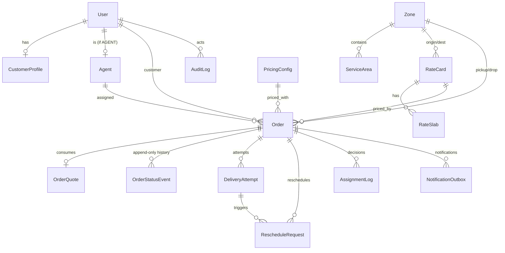

# Database schema

The full model is in [`apps/api/prisma/schema.prisma`](../apps/api/prisma/schema.prisma).
Money is integer paise, weights are grams, dimensions are whole centimetres.

## ERD (core entities)

## Key modelling decisions

- **Zone membership is data.** An order never stores a zone string; it references
  `pickupZoneId`/`dropZoneId` resolved from `ServiceArea.zoneId`. This is the
  brief's "admin assigns areas to zones", modelled relationally so it is
  editable and auditable.
- **Pricing is effective-dated and frozen.** `RateCard`, `RateSlab`,
  `SurchargeRule` and `PricingConfig` carry `effectiveFrom`/`effectiveTo`; each
  `Order` stores `rateCardId`, `pricingConfigId` **and** a `pricingSnapshot`
  JSON so a placed order's charge is reproducible forever.
- **`OrderStatusEvent` is append-only.** No `updatedAt`; a unique
  `(orderId, sequence)`; a `previousHash`/`hash` chain; and a database trigger
  that rejects `UPDATE`/`DELETE`. `Order.currentStatus` is a denormalised
  projection written in the same transaction.
- **Explainability is persisted.** `AssignmentLog.candidateSnapshot` stores every
  candidate's score components and every rejection reason.
- **Idempotency + audit.** `IdempotencyRecord` backs safe retries on mutations;
  `AuditLog` records every admin config change and status override with
  before/after JSON.

## Indexing strategy

Chosen for the hot paths: `ServiceArea.pincode` (zone resolution);
`Order.currentStatus` and `(pickupZoneId, currentStatus)` (admin filters);
`Order.assignedAgentId` (agent queue); unique `(OrderStatusEvent.orderId,
sequence)` (chain ordering); `(Agent.homeZoneId, availability)` (candidate
filtering); `NotificationOutbox.status` (worker drain).
