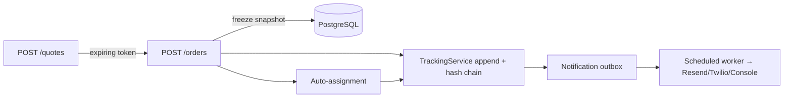

# System Design

*Word count: ~720 (excluding this line, headings and the diagram).*

## Rate calculation engine

The engine lives in `packages/shared/src/pricing` and is **pure**: no I/O, no
framework, no clock — the caller passes `asOf` and the loaded configuration.
That isolation makes correctness provable (45 table-driven tests, 100% branch
coverage on the calculator) and lets the browser run the identical logic while
the API stays authoritative. The algorithm resolves scope (intra/inter zone),
computes volumetric weight with a **configurable** divisor, takes the higher of
actual and volumetric, rounds up to the step and applies a floor — a single
rounding, so slab freight is linear. It selects the most specific effective
rate card (exact zone pair beats scope default; zero matches is a hard error,
never a silent zero), applies the slab, adds fuel and COD surcharges (flat /
percent / greater-of with min–max clamps), then tax last. **Trade-off:** rate
cards are effective-dated and every order freezes a `pricingSnapshot`, so
editing a card tomorrow never rewrites yesterday's charge. This costs extra
rows and a re-verification step but is exactly what real billing requires, and
it powers the `409 QUOTE_STALE` guarantee behind "charge shown before confirm".

## Zone detection

Zone membership is data (`ServiceArea.zoneId`), not a string on the order.
Resolution tries three strategies in order: exact pincode lookup (indexed,
fast, the common path); a geospatial fallback to the nearest serviceable
centroid by Haversine when coordinates are present but the pincode is unmapped;
otherwise a `422 ZONE_UNRESOLVED` naming the pincode so an admin can map it and
the customer can retry. **Trade-off:** no external geocoding dependency keeps
the demo working offline and the dependency list minimal, at the cost of a
seeded pincode table rather than universal coverage — acceptable because the
admin can map any pincode as data.

## Auto-assignment

`AutoAssignmentService.findBestAgent` filters eligible agents (AVAILABLE, under
capacity, in the pickup zone or within radius, and not an agent who already
failed this order) then scores them: `w_distance·distance + w_load·load +
w_staleness·locationAge`, weights held in an `AssignmentConfig` row, never in
code. Lower wins; ties break on `agentCode` for reproducible demos. Every
candidate's score components and every rejection reason are persisted to
`AssignmentLog.candidateSnapshot` and rendered as a "why this agent" panel — an
invisible algorithm made auditable. **Trade-off:** selection and the write run
in one transaction using an optimistic `version` lock on the agent row, so two
simultaneous auto-assigns cannot double-book; the loser retries rather than
silently overbooking. `activeOrderCount` is denormalised for fast candidate
filtering and mutated only inside the same transaction as an assignment or a
terminal status change.

## Failed-delivery handling

The lifecycle is an explicit state machine with per-transition allowed roles;
invalid moves return `409 INVALID_TRANSITION` naming what is permitted. When an
agent marks `FAILED`, a `DeliveryAttempt` row is written and the customer is
notified. The customer submits a new date, which moves `FAILED → RESCHEDULED`,
captures a `RescheduleRequest`, then auto-assignment runs again **excluding the
agent who failed**, landing back at `ASSIGNED` with `attemptCount + 1`. Every
attempt stays on the timeline forever as a segmented history rather than a
replaced state. **Trade-off:** notifications use a transactional outbox — the
status change and the outbox row commit together, so a rolled-back transaction
sends no phantom message and a committed one is guaranteed to be picked up by
the 10-second worker (retries with backoff to five attempts). This adds a table
and a poller versus firing email inside the request, but makes delivery
reliable and the request fast.

## Immutability

The tracking history is immutable in three layers: the repository exposes only
`append()`/`list()`; a database trigger raises on `UPDATE`/`DELETE`; and a
per-order SHA-256 hash chain (`hash = sha256(orderId | sequence | fromStatus |
toStatus | actorUserId | occurredAt | previousHash)`) is verified by
`GET /orders/:id/tracking/verify`. `Order.currentStatus` is a denormalised
projection of the latest event, written in the same transaction — the log is
the source of truth.
